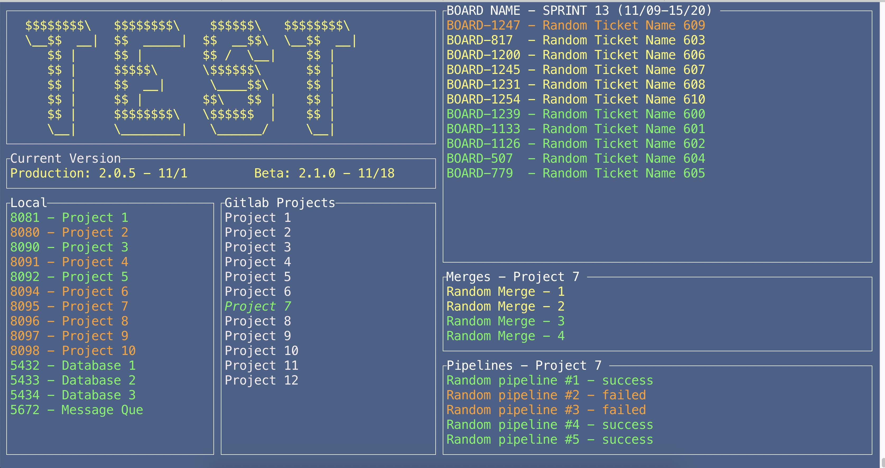

## About
The goal is to create a single terminal tab that can monitor local development, git repository information, and jira sprint.

Local panel applications are highlighted colors to reflect whether you are running that project locally or not.

Gitlab Projects panel is interactive using the ↑ and ↓ arrow keys to cycle through any remote repositories you configured. Hitting enter will fetch / refresh recent merge request and pipeline statuses.

Jira panel's ticket colors correspond to different board statuses eg "TODO", "IN_PROGRESS", "COMPLETED".

press "p" for party mode ( just rotates color of text in ascii block )

press "r" to refresh both gitlab and jira data.

press "q" to quit.

The app is constantly re-rendered in a loop so it will resize with your terminal.

## Setup
Applications json file contains information for all applications both gitlab projects as well as anything local such as databases or queues

to prevent an application from showing up under local set its port to 0

to prevent an application from showing up under gitlab projects set its port to 0

build_jira_issues_list_items() in ui.rs needs the match to be updated with relevant columns from your board

All gitlab and jira requests are commented out so that the app will launch before configuring it all.

## Running
The app needs two flags passed to it when ran for the api tokens
ex: "cargo run GITLAB_TOKEN JIRA-TOKEN" or "path_to_the_binary/terminalDashboard GITLAB_TOKEN JIRA-TOKEN"

When running the release build, the applications.json file needs to be in the same directory as the binary.
